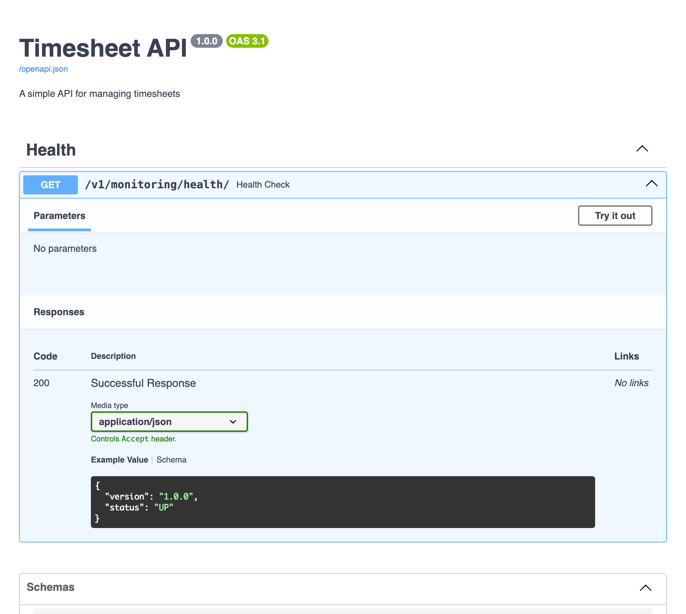

# timesheet v2

Timesheet Fastapi microservices


## launch server
```bash
uvicorn core.server:app --reload
```
### apply migrations
```bash
alembic upgrade head
```

### autogenerate models
```bash
alembic revision --autogenerate -m "initial models"
```


## Data Models
class User(Base):
    __tablename__ = "users"
    id = Column(Integer, primary_key=True, index=True)
    email = Column(String, unique=True, index=True)
    password = Column(String)
    role = Column(String, default="standard")

class Project(Base):
    __tablename__ = "projects"
    id = Column(Integer, primary_key=True, index=True)
    name = Column(String, unique=True, index=True)
    description = Column(String)
    created_by = Column(Integer, ForeignKey("users.id"))

class Task(Base):
    __tablename__ = "tasks"
    id = Column(Integer, primary_key=True, index=True)
    name = Column(String)
    description = Column(String)
    project_id = Column(Integer, ForeignKey("projects.id"))
    assigned_to = Column(Integer, ForeignKey("users.id"))

class Timesheet(Base):
    __tablename__ = "timesheets"
    id = Column(Integer, primary_key=True, index=True)
    user_id = Column(Integer, ForeignKey("users.id"))
    task_id = Column(Integer, ForeignKey("tasks.id"))
    date = Column(Date)
    hours = Column(Float)
    sap_code = Column(String)

## Demo
